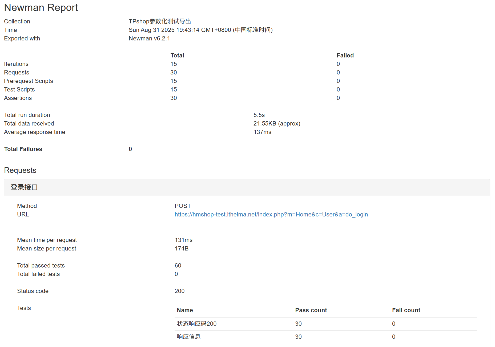
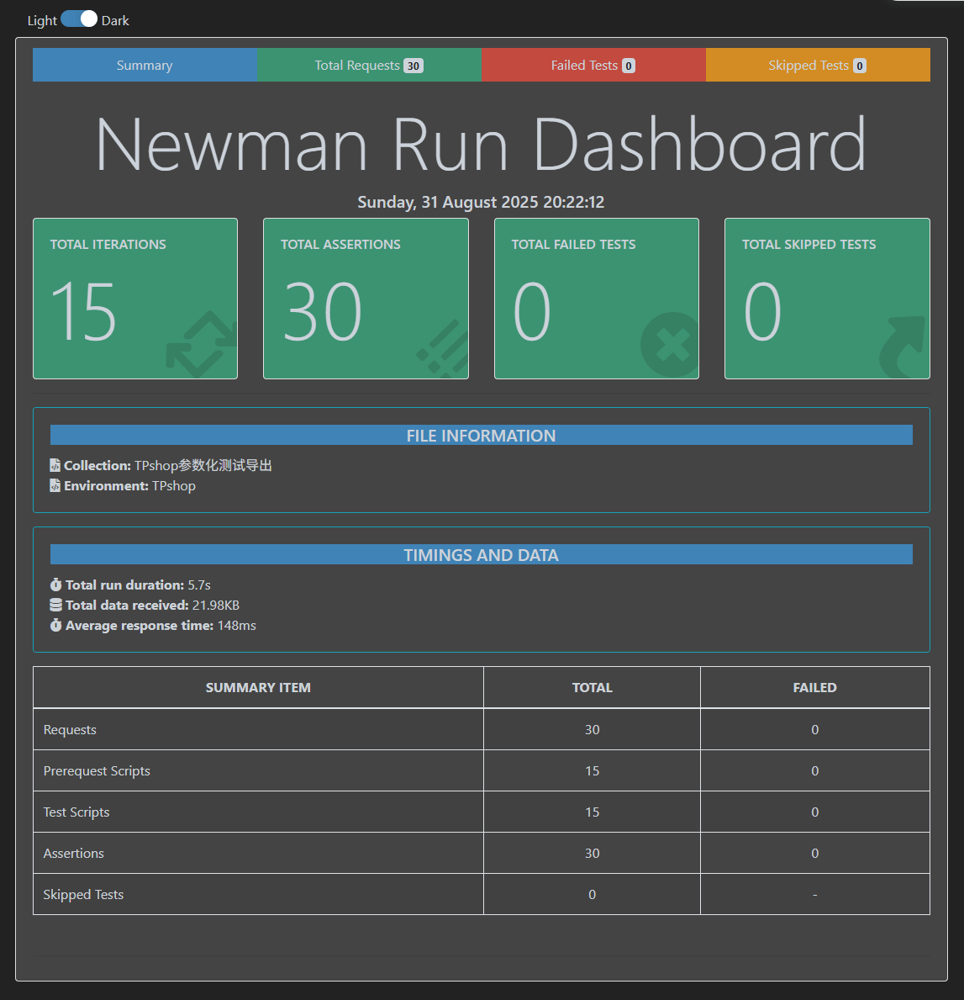

# Postman接口测试集
## 测试概述
- 项目类型：电商商城系统（TPshop）
- 测试模块：用户登陆模块
- 测试方法：等价类划分、边界值法
- 用例类型：正向用例 + 反向用例

包含了环境变量和测试用例，实现了参数化测试。

## 参数化测试
测试过程中，通过JSON数据文件保存测试用例，实现了参数化测试，支持：
- 批量执行测试用例
- 数据与测试逻辑分离
- 灵活的测试数据管理

同时，还加入了对响应状态码、返回信息的断言

## 快速开始
### 环境要求
- Node.js
- Newman
- 报告器插件

### 安装依赖
必须先下载安装Node.js
```bash
# 安装newman
npm install -g newman

# 安装newman-reporter-html
npm install -g newman-reporter-html

# 或安装newman-reporter-htmlextra
npm install -g newman-reporter-htmlextra
```

### 执行测试
#### 生成基础测试报告
特点：简介的基础测试报告

```bash
newman run TPshop测试用例导出.postman_collection.json -e TPshop.postman_environment.json -d TPshop参数化测试数据.json -r html --reporter-html-export report.html
```


#### 生成增强版测试报告
特点：提供更丰富的可视化数据和交互体验

```bash
newman run TPshop测试用例导出.postman_collection.json -e TPshop.postman_environment.json -d TPshop参数化测试数据.json -r htmlextra --reporter-htmlextra-export report_extra.html
```


### 测试数据设计
- ✅ 有效用户名密码组合
- ❌ 无效用户名/密码/验证码
- ⚠️ 边界值测试
- 🔒 参数值本身（多参/少参/无参/错参）